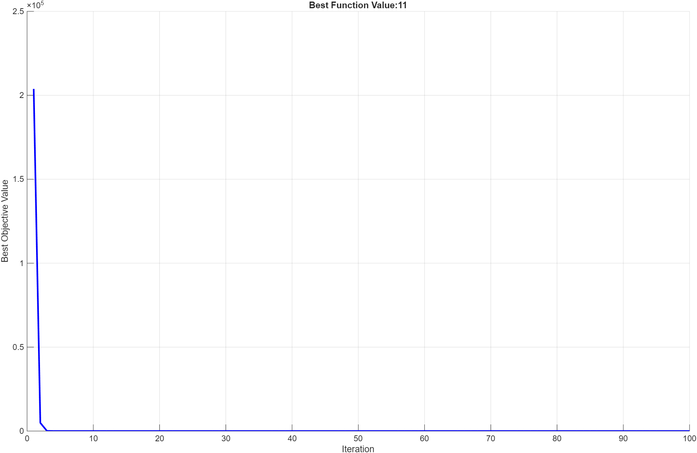
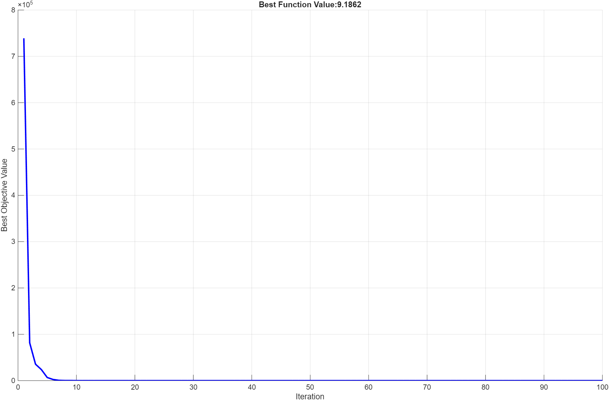
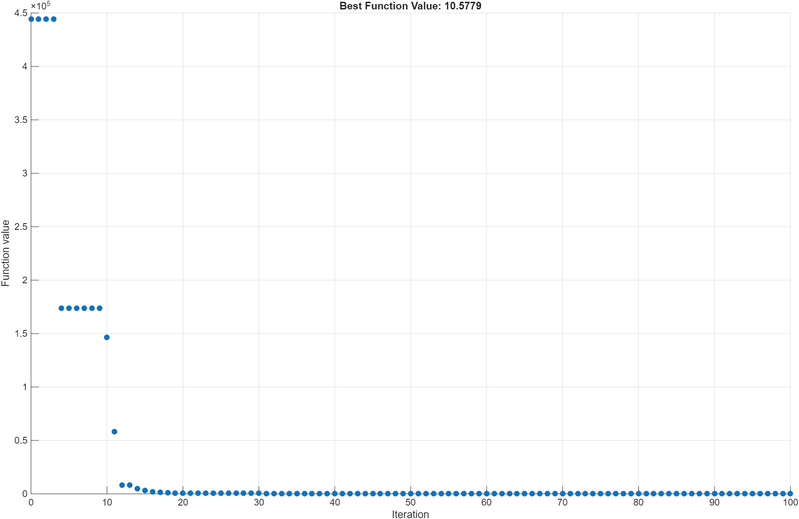
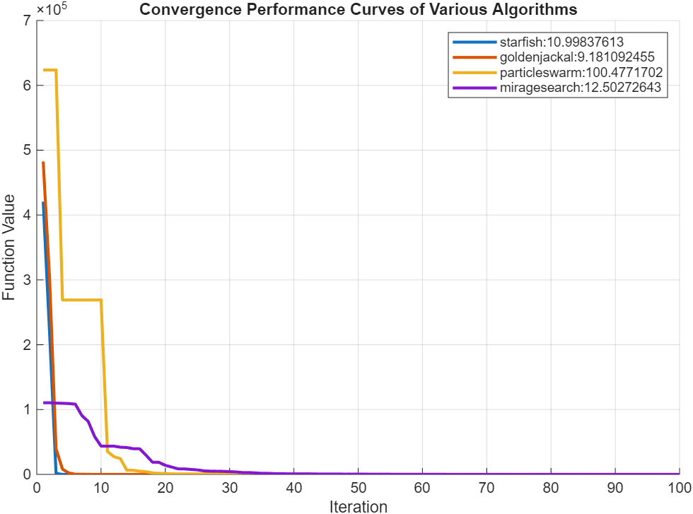

<a id="TMP_0866"></a>

# 一些元启发式进化优化算法比较

[](https://au.mathworks.com/matlabcentral/fileexchange/180962-evolutionary-algorithms)
[](https://matlab.mathworks.com/open/github/v1?repo=cuixing158/evolutionary-algorithms)

主要是对近年来goldenjackal[^1],(2022)，starfish[^2],(2025)一些群体智能优化算法做一些性能测试比较，体验其差异。对原始算法做了进一步的高度优化，比如并行处理，并支持实时性能绘图，规范代码书写，以符合MATLAB官方内置优化形式，目的在于提供易于直接使用的新型算法，可快速集成到自己的工程项目中！

starfish收敛速度相对最快，goldenjackal优化结果相对较好，但与starfish优化结果差距不大，miragesearch[^3]和particleswarm收敛和最优解相对较差。

Happy optimizing! 🚀✨

<!-- Begin Toc -->

## Table of Contents

&emsp;&emsp;[Requirements](#TMP_44bd)

&emsp;&emsp;[Algorithm Setup](#TMP_89c3)

&emsp;&emsp;[Optimization Algorithms](#TMP_853a)

&emsp;&emsp;[Performance Curve](#TMP_62dd)

&emsp;&emsp;[Some Benchmark Performance Functions](#TMP_2d2f)

&emsp;&emsp;[References](#TMP_6f24)

<!-- End Toc -->
<a id="TMP_44bd"></a>

## Requirements

- MATLAB R2025a or later

- Global Optimization Toolbox™
<a id="TMP_89c3"></a>

## Algorithm Setup

选择合适的评估算法和一些超参设置。

```matlab
f = @rosenbrock;% 性能测评函数，可自由下拉条选择评估函数
nvars = 12; % 优化维度数量，可自由定制
lb = -10 * ones(1, nvars); % 下边界，可自由定制
ub = 10 * ones(1, nvars);% 上边界，可自由定制
Npop = 50; % 群体数量，可自由定制
Max_it = 100;% 迭代终止最大次数，可自由定制
```

<a id="TMP_853a"></a>

## Optimization Algorithms

```matlab
t1 = tic;
[xposbest1,fvalbest1,Curve1] = starfish(f,nvars,lb,ub,SearchAgentsNumber=Npop,MaxIterations=Max_it,PlotFcns=true,UseParallel=false);
```



```matlab
toc(t1)
```

```matlabTextOutput
Elapsed time is 2.611676 seconds.
```

```matlab

t2 = tic;
[xposbest2,fvalbest2,Curve2] = goldenjackal(f,nvars,lb,ub,SearchAgentsNumber=Npop,MaxIterations=Max_it,PlotFcns=true,UseParallel=false);
```



```matlab
toc(t2)
```

```matlabTextOutput
Elapsed time is 2.287813 seconds.
```

由于内置的[particleswarm](https://au.mathworks.com/help/gads/particleswarm.html)函数不易拿到内部每次迭代的函数值，故通过记录log方式打印每次迭代结果，然后解析Iteration\-f(x)对应的值，最后综合相关算法做性能对比绘图。

> [!NOTE]
> **最好以传统的".m"文件形式运行本小节的代码！**

```matlab
diary pso_iter.txt % 这个diary函数对mlx内嵌输出不记录log！所以最好以传统的“.m”文件形式运行本小节的代码！
options = optimoptions('particleswarm', UseParallel=false, PlotFcn= @pswplotbestf, SwarmSize=Npop,MaxIterations=Max_it,Display="iter");
t3 = tic;
[xposbest3,fvalbest3,exitflag,output] = particleswarm(f, nvars, lb, ub, options);
```

```matlabTextOutput
                                 Best            Mean     Stall
Iteration     f-count            f(x)            f(x)    Iterations
    0              50       9.994e+05       2.667e+06        0
    1             100       9.994e+05       7.275e+06        0
    2             150       9.493e+05       3.473e+06        0
    3             200       9.493e+05       4.933e+06        1
    4             250       8.721e+05       3.676e+06        0
    5             300        2.63e+05       4.313e+06        0
    6             350       2.047e+05       3.901e+06        0
    7             400       1.844e+05       4.301e+06        0
    8             450       1.844e+05       4.294e+06        1
    9             500       1.844e+05       3.896e+06        2
   10             550       1.844e+05       4.218e+06        3
   11             600       1.844e+05       3.851e+06        4
   12             650       1.844e+05       4.135e+06        5
   13             700       1.844e+05       4.152e+06        6
   14             750       1.844e+05       2.593e+06        7
   15             800        1.37e+05       1.429e+06        0
   16             850       1.291e+05       9.226e+05        0
   17             900       3.776e+04       5.332e+05        0
   18             950       3.776e+04       3.421e+05        1
   19            1000       1.297e+04       1.981e+05        0
   20            1050            9460       8.841e+04        0
   21            1100            7031       6.347e+04        0
   22            1150            5629       1.526e+04        0
   23            1200            3403       1.316e+04        0
   24            1250            2732       1.179e+04        0
   25            1300            2129       5.376e+04        0
   26            1350            1580       5.293e+04        0
   27            1400           905.4       6.041e+04        0
   28            1450           905.4       1.686e+05        1
   29            1500           905.4       2.095e+05        2
   30            1550           905.4       3.073e+05        3

                                 Best            Mean     Stall
Iteration     f-count            f(x)            f(x)    Iterations
   31            1600           905.4        3.69e+05        4
   32            1650           905.4       5.132e+05        5
   33            1700           905.4       7.664e+05        6
   34            1750           905.4       2.684e+05        7
   35            1800           502.7       5.809e+04        0
   36            1850           502.7       6.268e+04        1
   37            1900           338.1       4.397e+04        0
   38            1950           334.5       2.606e+04        0
   39            2000           334.5       1.671e+04        1
   40            2050           319.3            1985        0
   41            2100           303.5            1725        0
   42            2150           274.7            1627        0
   43            2200           266.9           403.9        0
   44            2250           248.6           416.9        0
   45            2300           248.6           338.4        1
   46            2350           223.3           324.8        0
   47            2400             220           251.7        0
   48            2450             220           919.9        1
   49            2500           218.6             307        0
   50            2550           218.6           329.9        1
   51            2600           218.6           338.6        2
   52            2650           217.9           436.8        0
   53            2700           217.9           915.3        1
   54            2750           217.9            1612        2
   55            2800           217.9            1133        3
   56            2850           216.9            5483        0
   57            2900           216.9            3205        1
   58            2950           216.9       2.585e+04        2
   59            3000           216.9       2.646e+04        3
   60            3050           201.3            9824        0

                                 Best            Mean     Stall
Iteration     f-count            f(x)            f(x)    Iterations
   61            3100           201.3            9006        1
   62            3150           195.7            3166        0
   63            3200           195.7            1507        1
   64            3250           188.9            1617        0
   65            3300           184.6           585.8        0
   66            3350           183.7             424        0
   67            3400           174.3           240.9        0
   68            3450           166.2           228.4        0
   69            3500           158.9           213.5        0
   70            3550           155.7           206.3        0
   71            3600           150.6             253        0
   72            3650           139.6           257.3        0
   73            3700           139.6             306        1
   74            3750           122.8             307        0
   75            3800           122.8           500.7        1
   76            3850           122.8           516.8        2
   77            3900           122.8            1008        3
   78            3950           122.8            1687        4
   79            4000           122.8            2751        5
   80            4050           122.8            4007        6
   81            4100           122.8            1449        7
   82            4150           122.8            1597        8
   83            4200             114           321.1        0
   84            4250             114           257.3        1
   85            4300           106.1           226.7        0
   86            4350           102.8           198.3        0
   87            4400           99.67           199.2        0
   88            4450           95.73           136.7        0
   89            4500           92.96           139.2        0
   90            4550           90.81           121.2        0

                                 Best            Mean     Stall
Iteration     f-count            f(x)            f(x)    Iterations
   91            4600           87.57           101.6        0
   92            4650           77.48           98.58        0
   93            4700           77.48           91.18        1
   94            4750           69.58            85.1        0
   95            4800           29.25           82.03        0
   96            4850           29.25           86.39        1
   97            4900           29.25             164        2
   98            4950           29.25           243.6        3
   99            5000           29.25           479.5        4
  100            5050           28.71           510.2        0
Optimization ended: number of iterations exceeded OPTIONS.MaxIterations.
```



```matlab
toc(t3)
```

```matlabTextOutput
Elapsed time is 2.325318 seconds.
```

```matlab
diary off

[iterations, bestFvals] = extractPSOLogData("pso_iter.txt");
delete("pso_iter.txt");
Curve3 = bestFvals(:)';

t4 = tic;
[xposbest4,fvalbest4,Curve4] = miragesearch(f,nvars,lb,ub,SearchAgentsNumber=Npop,MaxIterations=Max_it,PlotFcns=true,UseParallel=false);
toc(t4)
```

```matlabTextOutput
Elapsed time is 0.140662 seconds.
```

<a id="TMP_62dd"></a>

## Performance Curve

```matlab
figure;
grid on;
hold on;

plot([Curve1;Curve2;Curve3;Curve4]',LineWidth=2)
xlabel("Iteration");
ylabel("Function Value");
title("Convergence Performance Curves of Various Algorithms")
legend(["starfish:"+string(vpa(fvalbest1,10)),...
    "goldenjackal:"+string(vpa(fvalbest2,10)),...
    "particleswarm:"+string(vpa(fvalbest3,10)),...
    "miragesearch:"+string(vpa(fvalbest4,10))])
```


<a id="TMP_2d2f"></a>

## Some Benchmark Performance Functions

```matlab
% Optimization Test Functions for Performance Evaluation
% These functions are designed to test optimization algorithms on complex,
% multi-modal, non-convex problems with multiple local optima.
% Each function is implemented for n-dimensional input with boundary constraints.

% 1.complexObjective
function y = complexObjective(x)
% x 是一个 n 维向量
% Rastrigin函数（多峰函数，优化难度较大）
A = 10;
n = length(x);
rastrigin = A * n + sum(x.^2 - A * cos(2 * pi * x));

% 计算密集型模拟部分（人为加入耗时）
pauseTime = 0.01; % 模拟每次评估耗时0.01秒
tic; while toc < pauseTime; end

% 非线性耦合项
coupling = 0;
for i = 1:n-1
    coupling = coupling + 100*(x(i+1)-x(i)^2)^2 + (1 - x(i))^2;
end

% 组合目标函数
y = rastrigin + coupling;
end

% 2.multiModalTestFunc
function y = multiModalTestFunc(x)  
% multiModalTestFunc - 多极点复杂测试函数  
% 输入:  
%   x - n维向量，优化变量  
%  
% 输出:  
%   y - 函数值，目标函数输出，越小越优  

% 参数设置  
n = length(x);  
m = 5;  % 多极点数目  

% 初始化极点位置，可以随机也可以预设  
% 这里预设m个极点，每个极点在n维空间里随机分布[-5,5]  
persistent poles  
if isempty(poles)  
    rng(1); % 保证重复性  
    poles = 10 * rand(m, n) - 5;  
end  

% 每个极点对应的高斯峰，权重和宽度可以不一样  
weights = linspace(1, 2, m);          % 权重，也可以自定义  
sigmas = linspace(0.5, 1.5, m);      % 峰的宽度  

% 计算每个极点上的高斯型函数值并组合  
y = 0;  
for i=1:m  
    diff = x - poles(i, :);  
    distSq = diff * diff'; % 欧氏距离平方  
    % 多极点负高斯峰，目标函数值为负峰叠加 (需要最小化)  
    y = y - weights(i) * exp(-distSq / (2 * sigmas(i)^2));  
end  

% 加入一个全局趋势，比如一个简单的凹函数，增加搜索难度  
y = abs(y) + 0.01 * sum(x.^2);  
end  

% 3. Rastrigin Function
% Characteristics: Highly multi-modal, many local minima, non-convex, symmetric
% Global minimum: f(x) = 0 at x = [0, 0, ..., 0]
% Bounds: x_i in [-5.12, 5.12]
function f = rastrigin(x)
    n = length(x);
    A = 10;
    f = A * n + sum(x.^2 - A * cos(2 * pi * x));
end

% 4. Ackley Function
% Characteristics: Multi-modal, non-convex, nearly flat outer region, deep global minimum
% Global minimum: f(x) = 0 at x = [0, 0, ..., 0]
% Bounds: x_i in [-32.768, 32.768]
function f = ackley(x)
    n = length(x);
    a = 20;
    b = 0.2;
    c = 2 * pi;
    sum1 = sum(x.^2);
    sum2 = sum(cos(c * x));
    f = -a * exp(-b * sqrt(sum1 / n)) - exp(sum2 / n) + a + exp(1);
end

% 5. Griewank Function
% Characteristics: Multi-modal, non-convex, many widespread local minima
% Global minimum: f(x) = 0 at x = [0, 0, ..., 0]
% Bounds: x_i in [-600, 600]
function f = griewank(x)
    n = length(x);
    sum_term = sum(x.^2 / 4000);
    prod_term = prod(cos(x ./ sqrt(1:n)));
    f = 1 + sum_term - prod_term;
end

% 6. Schwefel Function
% Characteristics: Multi-modal, non-convex, deceptive global minimum far from local minima
% Global minimum: f(x) = 0 at x = [420.9687, 420.9687, ..., 420.9687]
% Bounds: x_i in [-500, 500]
function f = schwefel(x)
    n = length(x);
    f = 418.9829 * n - sum(x .* sin(sqrt(abs(x))));
end

% 7. Rosenbrock Function
% Characteristics: Non-convex, narrow parabolic valley, difficult to converge to global minimum
% Global minimum: f(x) = 0 at x = [1, 1, ..., 1]
% Bounds: x_i in [-5, 10]
function f = rosenbrock(x)
    n = length(x);
    f = sum(100 * (x(2:n) - x(1:n-1).^2).^2 + (1 - x(1:n-1)).^2);
end

```

<a id="TMP_6f24"></a>

## References

[^1]: Chopra, Nitish, and Muhammad Mohsin Ansari. "Golden Jackal Optimization:A Novel Nature\-Inspired Optimizer for Engineering Applications." Expert Systems with Applications (2022): 116924.
[^2]: Changting Zhong, Gang Li, Zeng Meng, Haijiang Li, Ali Riza Yildiz, Seyedali Mirjalili."Starfish Optimization Algorithm (SFOA): A bio\-inspired metaheuristic algorithm for global optimization compared with 100 optimizers. " Neural Computing and Applications(2025), 37: 3641\-3683.
[^3]: Jiahao He, Shijie Zhao, Jiayi Ding, Yiming Wang. "Mirage search optimization: Application to path planning and engineering design problems." Advances in Engineering Software(2025), DOI: <https://doi.org/10.1016/j.advengsoft.2025.103883>
